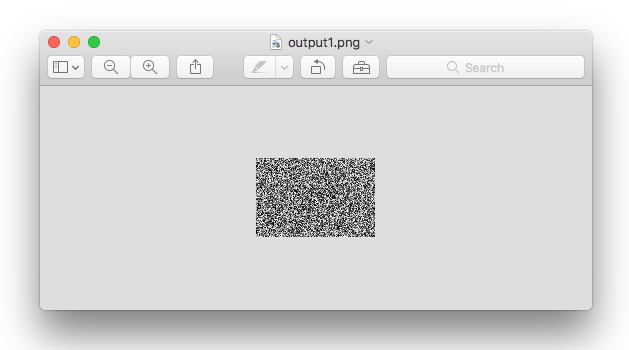

# PNG-Coverage-Generator
Quick scripts for random PNG generation--intended to provide source image files for code coverage.

# Usage
```
USAGE: outFileName fileCount
```
The program will output fileCount randomized png images per folder, with a folder for each
unique PNG format.

Here's an example for the 'L' (single channel greyscale) option and outFileName = ```output```:
```
pngcoverage-output-l
├── output0.png
├── output1.png
└── output2.png

0 directories, 3 files
```
Sample image:




# Developer Notes

Setting up python virtual environments:
```
python3 -m virtualenv env
source env/bin/activate
```
